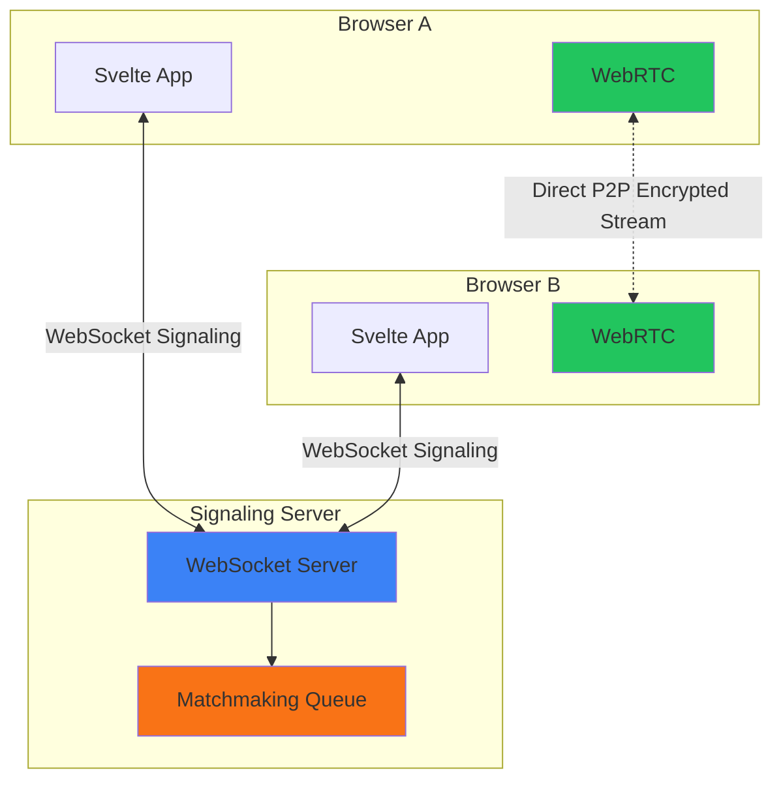
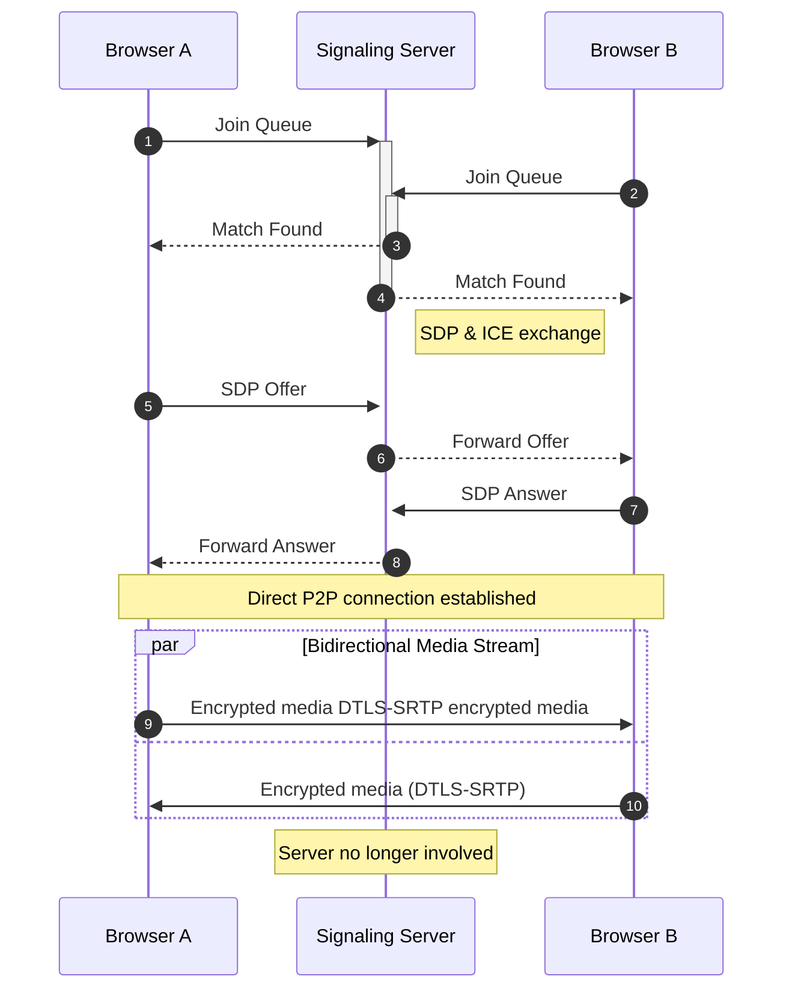
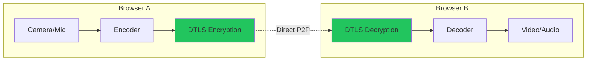
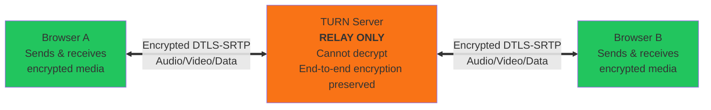

I've always thought eating is fundamentally a communal experience. Although technology can foster isolation, my goal with this project was to leverage it instead to facilitate genuine human connection over meals.

Many apps claim to prioritize privacy, but in video streaming, true privacy requires specific technical engineering, not just a promise. For the launch of "Eat With Me" the goal was precise: allow users to have high-quality video chats directly with one another, ensuring the app's central servers never access, process, or record the video feed.

This post analyzes the architectural decisions behind why traditional video streaming architectures using **SFU** (Selective Forwarding Unit) or **MCU** (Multipoint Control Unit) are not privacy-first and how to implement a pure peer-to-peer (P2P) mesh using the latest WebRTC standards.

## The Architectural Constraint: Trustless by Design

As just mentioned, one of the core requirements was to ensure that user video feeds could not be recorded, stored, or analyzed by the host server. In a traditional client-server video architecture (like Zoom or Google Meet), streams are routed through a media server. While this is efficient and very scalable for large groups, it requires users to trust the provider. For this project, I wanted to avoid this dependency and remove risks as well as keeping the project cost low. 

To do so, I implemented a simple P2P topology:




### The Signaling Handshake

While the video is P2P, the browsers must first locate each other. This "signaling" phase is handled by a lightweight Node.js WebSocket server.

Crucially, the server acts only as a matchmaker. It exchanges the Session Description Protocol (SDP) and ICE Candidates (network paths) but never proxies the actual media blobs.

The flow is strictly ephemeral:

1. Users (browser A & B) connect to WebSocket Signaling Server.
2. Server matches them based on queue parameters (Group Size).
3. Browser A generates an Offer (SDP).
4. Browser B generates an Answer (SDP).
5. ICE Candidates establish the direct P2P connection.




Once the RTCPeerConnection moves to the connected state, the WebSocket server becomes irrelevant to the media stream.


## Security Implementation: DTLS-SRTP

The security model relies on DTLS-SRTP (Datagram Transport Layer Security over Secure Real-time Transport Protocol).

Unlike HTTPS which encrypts data between client and server, DTLS-SRTP negotiates encryption keys directly between the two peers during the handshake.

- **Key Exchange:** Occurs via the DTLS handshake on the media path.
- **Encryption:** AES-256*.
- **Integrity:** HMAC-SHA-256 or stronger*.

\* Depends on browser capability.




Since the signaling server does not possess the private keys generated during the DTLS handshake, it is mathematically impossible for the server to decrypt the video stream. 

## Challenges: The Limitations of P2P

While the P2P architecture solves the privacy and cost problem, it introduces specific engineering limitations that developers should acknowledge.

### The Bandwidth Scaling Problem

In a "Mesh" topology (used here), every participant sends their stream to every other participant.

- 2 Users: 1 up, 1 down.
- 3 Users: 2 up, 2 down per user.
- 4 Users: 3 up, 3 down per user.

The Caution: CPU and Upload Bandwidth usage scales exponentially. This architecture is viable for 1-to-1 or small groups (3-4 max). For larger gatherings, this approach fails, and an SFU (Server) becomes necessary.

### TURN: the P2P backup plan

P2P relies on direct IP visibility. Some enterprise firewalls and symmetric NATs (common in cellular networks) frequently block these direct paths. It happened to me while testing the application on my phone I couldn't connect to the signaling server so I had to implement a TURN server to handle the NAT traversal. 

For must of the time (~80%) for this application I make use of STUN Servers resolve public IPs but fail behind symmetric NATs (I'm using Google's free STUN server). 

However, to mitigate the NAT traversal problem I had to implement a TURN server. TURN servers act as relays, forwarding media packets between peers when direct connections are blocked: 



The TURN server acts as a blind relay, forwarding media packets between peers when direct connections are blocked. All media remains fully encrypted in transit. Privacy 100% preserved.

## Frontend: Why Svelte 5?

Video applications are inherently state-heavy. You are managing connection states (new, checking, connected, failed), media tracks, and UI toggles simultaneously.

I chose Svelte 5 specifically for its new Runes system. In React, managing WebSocket event listeners inside useEffect hooks often leads to closure traps or stale state bugs. Svelte's fine-grained reactivity allows for a cleaner separation of concerns.

```ts
// Simplified Svelte 5 State Logic
let connectionState = $state('disconnected');
let peerConnection: RTCPeerConnection;

$effect(() => {
  // Direct reaction to state changes 
  if (connectionState === 'connected') {
    startMetricsCollection();
  }
});
```

## AI dining companion: The backup plan to increase engagement

I also implemented the AI dining companion feature to increase engagement (using the Google Gemini Live API) as a liquidity provision mechanism to solve the "empty queue" problem. 

It uses native multimodal streaming (`gemini-live-2.5-flash-preview-native-audio-09-2025`) that processes raw audio (16kHz PCM) and video frames (1 FPS JPEG) directly, bypassing traditional Speech-to-Text/Text-to-Speech pipelines. I really wanted to try out this direct approach to multimodal streaming and I was quite surprised by the results.


However, the end-to-end latency chain (audio buffering -> network RTT -> Gemini inference -> audio playback) introduces a 2-3 second delay which can be disorienting for users. The voice feels natural though and it can speak in 24 different languages. 


## Conclusion

Eat With Me has been a fun, engaging and educational project. It demonstrates a privacy-first video architecture is viable for small-group interactions using modern WebRTC standards. It is very cool to see how WebRTC has come a long way since I first started learning about it at uni. This project made me go deeper into web sockets, P2P networking, security, WebRTC, Svelte 5 and AI API's. 

Developers replicating this stack should remain wary of the bandwidth constraints inherent in mesh networking and the hidden infrastructure costs of TURN relays.

You can try the app here: [Eat With Me](https://eatwithme.live)
