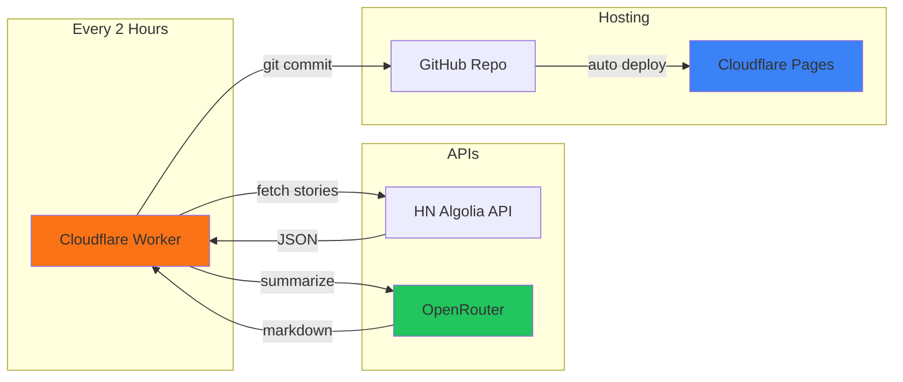

It's become my morning coffee ritual to scroll through Hacker News. The thing is, most days I'm reading the same debates recycled with different titles. "Is X technology dead?" "Why I left Big Tech." "Show HN: I built a thing."

Don't get me wrong, there's genuinely valuable content on HN. The comments often contain insights you won't find anywhere else, engineers who've actually built the systems being discussed chiming in with war stories. But finding that signal takes time I don't always have.

So I built [HN-Brief](https://hn-brief.com) — a site that automatically fetches the top 20 stories each day, summarizes both the articles and their discussions, and presents everything in a quick-read format. It took a weekend to build, costs me nothing to run, and now I can get my HN fix in about 5 minutes.

## What the Site Actually Does

When you visit [hn-brief.com](https://hn-brief.com), you'll see the current day's summary with two viewing modes you can toggle between:

### Digest Mode (default)

This is the one I use most. Instead of 20 separate summaries, it synthesizes everything into a single flowing narrative. It reads more like a newsletter than a list of links.

The idea here was to capture how you'd describe the day's tech news to a colleague over lunch. "So apparently there's drama about X, and someone open-sourced a thing that does Y, and the usual crowd is complaining about Z." That kind of thing.

I spent a lot of time trying to get the tone right. Early versions were painfully generic, lots of "good morning", "let's dive in" and "the community was buzzing." Nobody talks like that. I had to go through a few prompting iterations to get it right.

### Article Mode

This gives you individual breakdowns for each of the top 20 stories. For every story, you get:

- A summary of the article itself (what it's actually about, not just the clickbait title)
- A summary of the HN discussion (the interesting takes, the pushback, the "well actually" corrections that sometimes matter)
- The story metadata (points, comment count, link to the original)

I built this mode for days when I want to skim headlines and dive deeper into specific topics that catch my interest. It's like having someone read the articles for you and give you the TLDR, plus tell you what people thought about it.

### The Archive

There's a calendar picker that lets you browse previous days. Every summary since launch is available, so you can catch up if you missed a few days or look back at what was trending last week. 

I have plans to generate summaries for the past years, but I was afraid of running into rate limits. I'll have to see how it goes.

## How It's Built

The whole thing runs on free tiers. No servers, no databases, no monthly bills.



A Cloudflare Worker runs on a cron schedule. It hits the HN Algolia API, grabs the top stories from the last 24 hours sorted by points, then sends each one to an LLM for summarization. The output is markdown files that get committed directly to a GitHub repo. Cloudflare Pages watches that repo and redeploys automatically.

The frontend is just vanilla HTML/CSS/JS. No React, no node_modules. It fetches the markdown files and renders them. I intentionally kept the design minimal: Verdana font, orange header, dense layout. If you've been on HN, it should feel familiar 🟧

## The Summarization Process

This was the interesting engineering problem. Getting useful summaries out of an LLM isn't just "pass text to API, receive summary."

### Fetching the Content

For each story, I grab:
1. The article text itself (via a URL fetch and extraction)
2. The top-level comments from HN (For each of those, the first 2 replies are included)
3. The story metadata (title, points, author, URL)

The comments are often more valuable than the article. Someone posts a new database, and the comments have a principal engineer from Postgres explaining why the benchmarks are misleading. Someone shares a startup postmortem, and the comments have former employees adding context. That's the stuff I want to capture. For the article summaries, I've decided to only top-level comments and replies for llm speed and improved signal/noise ratio.

### Crafting the Prompts

I use different prompts for article mode versus digest mode.

For **article summaries**, the prompt asks for:
- A neutral summary of what the article claims or describes
- Key technical details if applicable  
- A summary of the discussion highlighting agreements, disagreements, and additional context from commenters
- Any notable corrections or caveats raised

For the **digest**, it's more like:
- Given these 20 stories and their discussions, write a cohesive overview of today's tech news
- Group related topics naturally
- Assume the reader is technical and doesn't need basic concepts explained
- Skip anything that's just drama or meta-discussion about HN itself

The tone instruction I settled on: "Write like a senior engineer explaining the day's news to a colleague. Direct, slightly opinionated, no fluff."

### LLM used

I used the current most popular LLM at the time of writing, `Xiaomi MiMo-V2-Flash`. 
The main reason for this choice was that it was `free` and solid. It performs really well in benchmarks, the output tokens throughput is very decent and worked well with my custom prompts. It also ranks well on benchmarks alongside other SOTA models like GPT 5.1 and Gemini 3.0... 

It can also use reasoning which I use for the digest mode to dig deeper and create a more cohesive overview grouping related topics naturally.

If I had to choose the best model for this would probably be KIMI k2 for it's well known writting style but I think I did a good job with the prompts to adapt the output to my needs.

### Avoiding LLM-isms

Early digests were rough. They'd start with "Good morning, tech enthusiasts!" or include transitions like "Moving on to our next topic..." Nobody writes like that except LLMs pretending to be newsletters.

I added an explicit blocklist to the prompt:

```
NEVER use:
- Greetings or sign-offs
- "Let's dive in" / "without further ado" / "buckle up"
- "The tech community" / "developers were excited"
- Rhetorical questions as transitions
- Emoji
```

It sounds heavy-handed, but it works. The output now reads more like something a person would actually write.

## Why Cloudflare Workers

Basically I've choosen Cloudflare workers because I was already familiar with it and I kenw I could run the job reliably and free of cost.

Also, I wanted a scheduled execution without managing anything. so I used the `scheduled()` handler that runs on a cron and set it to every 2 hours to keep the content fresh though the day. 

And content should be updated with the most up to date information at the end of the day.

## Using GitHub as Storage

No database needed. Summaries are just markdown files in a git repo:

```
summaries/
├── archive.json
└── 2025/
    └── 12/
        ├── 29.md          # Article mode
        └── 29-digest.md   # Digest mode
```

The Worker commits directly via the GitHub API. Each commit triggers a Cloudflare Pages redeploy. The whole pipeline from "Worker runs" to "site updated" takes about 20 seconds.

The `archive.json` tracks which dates have content, so the frontend calendar knows which dates to enable.

## Things That Went Wrong

### Stale Stories

The HN API returns stories sorted by score, but high-scoring stories can linger for days. I fixed this by ensuring the Algolia query strictly filters for stories created within the last 24 hours:

``` ts
const now = Math.floor(Date.now() / 1000);
const yesterday = now - 86400;
const url = `${ALGOLIA_API}/search?tags=story&numericFilters=created_at_i>${yesterday},points>10&hitsPerPage=50`;
```

This offloads the filtering to the API level, ensuring we only ever receive and process fresh content.

### Rate Limits

#### API Rate Limits

OpenRouter has rate limits. HN's Algolia API is pretty generous but not unlimited.

To avoid rate limits, the code uses a hybrid approach: it processes 10 stories at once, waits half a second, then processes the next 10 with a short cooldown between each.


```ts
const BATCH_SIZE = 10;

for (let i = 0; i < storyDetails.length; i += BATCH_SIZE) {
  const batch = storyDetails.slice(i, i + BATCH_SIZE);
  await Promise.all(batch.map(async ({ hit, details }) => {
    return summarizeStory(hit, details.children || [], llmConfig);
  }));

  if (i + BATCH_SIZE < storyDetails.length) {
    await new Promise(r => setTimeout(r, 500));
  }
}
```

#### Cloudflare Workers Subrequests Call limit

Cloudflare free tier has a subrequests limit of 50 requests per execution. Since the worker is a very heavy on requests I had to optimise the calls to the API to avoid hitting the limit and maximissing it, every worker request making 49 requests per execution:


```
Operation                       Request Count   Service
fetchTopStories                 1               HN Algolia
fetchStoryDetails (Top 20)      20              OpenRouter
summarizeStory (Top 20)         20              OpenRouter
generateDigest                  1               GitHub
commitToGitHub (Articles)       2               GitHub
commitToGitHub (Digest)         2               GitHub
updateArchive                   3               GitHub
Total                           49
```

## Local Development

I didn't want to deploy to Cloudflare every time I tweaked a prompt. There's a CLI script that does the same thing locally so I can generate multiple summaries and digests at the same time without wasting worker execution time:

```bash
bun run summarize              # Today's summaries
bun run summarize -- -d 2025-12-25  # Specific date
bun run summarize -- -g        # Digest only
```

This made prompt iteration much faster. I could generate, review, adjust or regenerate.

## What I'd Do Differently

**Better Threading Logic.** Right now, I just take the first 10 top-level comments and their first 2 replies. This captures the main sentiment, but it misses deep, insightful sub-threads. A smarter traversal of the comment tree would pick higher-quality discussion points regardless of their depth.

**User preferences.** Right now it's one size fits all. Would be nice to let people filter by topic or skip certain categories. But that requires user accounts and storage, which breaks the "zero infrastructure" constraint.

**Better LLM selection.** I'm using OpenRouter, but it's not the best for this use case. I'd like to use a more specialized LLM, but that would require a paid service.


## Wrapping Up

The whole project took a weekend to build and has been running autonomously since. Total infrastructure cost: $0. The only ongoing expense is the LLM API calls is free (for now) but it will cost about $2-3/month for daily summarization of 20 articles if I had to pay for it.

It scratches my itch. I've checked it this morning and I was proud of the results reading the digest, I was very happy to see something I've built the way I've envisoned it. Saved time, less scrolling, same FOMO satisfaction.

Try it out: [hn-brief.com](https://hn-brief.com)

Code's on [GitHub](https://github.com/jnd0/hn-brief) if you want to see how it works or run your own version.
